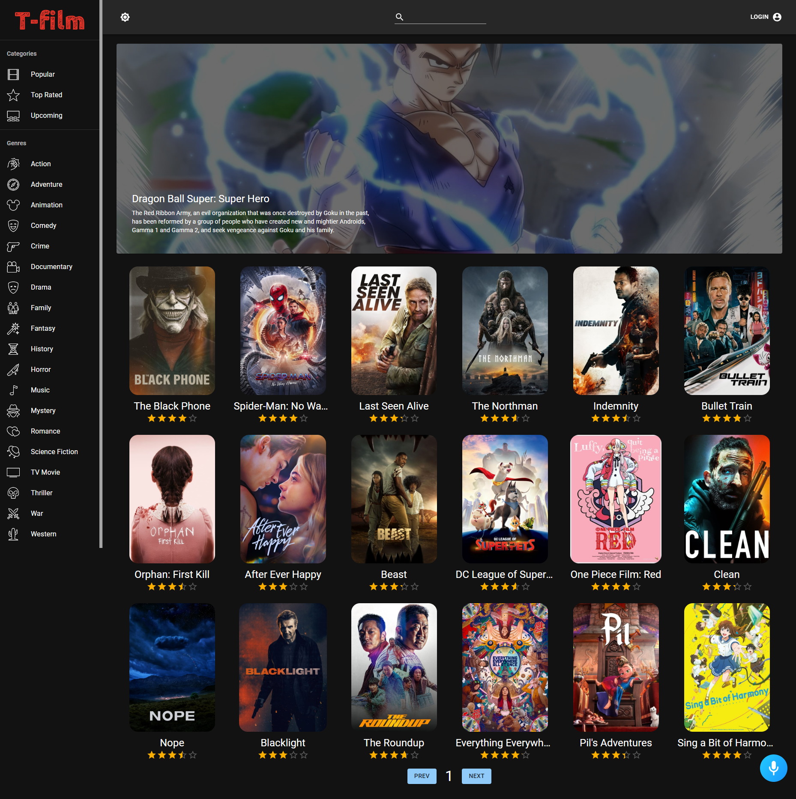

# T-film project
## A website for movie lover
I build this site using react apps, connect to IMDB APIs

live project: https://t-film.netlify.app/

## Features
- Voice recognition command (can use to navigate through the site)
- Themes select between light and dark
- Login / Autheticated with IMDB
- Add to favourites, Save to watch later
- Movie details, trailers, rating and actors
- Responsive UX/UI for mobile and desktop

## Voice Command

- To start, say "Hello". You will hear some sample voice command you can use.
- "Make it light" = change theme to light
- "Make it dark" = change theme to dark
- "Go to comedy" = jump to comedy categories (can also change comedy to some other categories)
- "Surprise me" = jump to random categories

